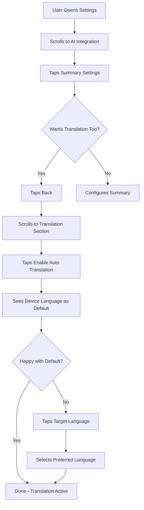
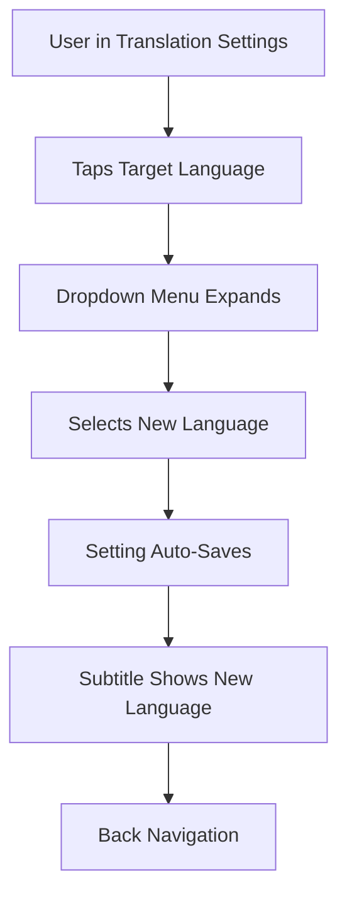
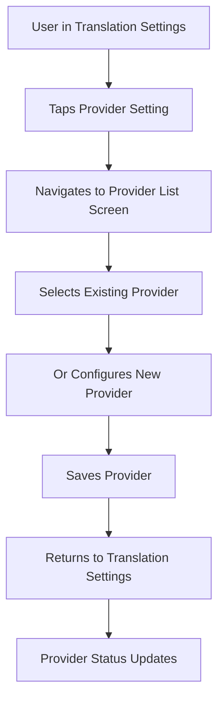

# Design Specification: Translation Configuration

**Date:** 2026-01-03
**Version:** 1.0.0
**Feature:** Translation Settings under AI Integration
**Framework:** Jetpack Compose, Material 3

---

## Executive Summary

This design specification defines the UI/UX for translation configuration settings in the Feeder app. The feature allows users to enable automatic translation of feed items and configure target language preferences. The design follows established Material 3 patterns in Feeder, specifically mirroring the SummarySettingsScreen structure for consistency.

**Key Design Decisions:**
- Mirror SummarySettingsScreen layout for established UX patterns
- Reuse existing SwitchSetting and LanguageSelectorSetting components
- Device language as default target language (reduces setup friction)
- Provider selection reuses existing AI provider infrastructure

---

## User Context

### Target Users
- **Primary:** Multilingual users who consume content in languages they don't fluently read
- **Secondary:** Users who prefer reading content in their native language
- **Tertiary:** Researchers/academics who need translations for global sources

### User Goals
1. Automatically translate foreign language articles to preferred language
2. Configure which language to translate articles into
3. Choose which AI provider handles translation
4. Enable/disable translation quickly without deep navigation

### Success Criteria
- User can enable auto-translation in 2 taps
- Target language selection is clear and reversible
- Provider selection uses existing configuration (no redundant setup)
- Settings match visual patterns of other AI settings (Summary)

---

## User Flows

### Flow 1: Enable Translation for First Time



### Flow 2: Change Target Language



### Flow 3: Select Translation Provider



---

## Screen Inventory

### Screen 1: Translation Settings Screen (Primary)

**Purpose:** Configure automatic translation settings
**Entry:** Settings → AI Integration → Translation Settings
**Exit:** Back navigation or tap outside

#### Layout (ASCII Wireframe)

```
┌─────────────────────────────────────────────────────┐
│ ← Translation Settings                     [...]   │  <- SensibleTopAppBar
├─────────────────────────────────────────────────────┤
│                                                     │
│ ┌───────────────────────────────────────────────┐ │
│ │  [Icon Space]  Enable Auto Translation    [ON]│ │  <- SwitchSetting
│ └───────────────────────────────────────────────┘ │  <- 64dp min height
│                                                     │
│ Description: Automatically translate articles     │
│ to your preferred language using AI                │
│                                                     │
│ ┌───────────────────────────────────────────────┐ │
│ │  [Icon Space]  Target Language           [>] │ │  <- LanguageSelectorSetting
│ │                           English             │ │
│ └───────────────────────────────────────────────┘ │  <- 64dp min height
│                                                     │
│ ┌───────────────────────────────────────────────┐ │
│ │  [Icon Space]  AI Provider              [>] │ │  <- ExternalSetting
│ │                           OpenAI Compatible   │ │
│ └───────────────────────────────────────────────┘ │  <- 64dp min height
│                                                     │
└─────────────────────────────────────────────────────┘
```

#### Component Breakdown

**Top Bar:**
- Height: 64dp
- Back button: 48dp touch target
- Title: "Translation Settings"
- Actions: None (or overflow menu if needed)

**Enable Auto Translation (SwitchSetting):**
- Min height: 64dp
- Icon space: 64dp x 64dp (empty, aligned with other settings)
- Title: "Enable Auto Translation"
- Subtitle: "Automatically translate articles to your preferred language"
- Switch: Right-aligned, 48dp touch target
- State announcement: "On" / "Off" for screen readers
- Colors:
  - Title: MaterialTheme.colorScheme.onSurface
  - Subtitle: MaterialTheme.colorScheme.onSurfaceVariant (60% alpha)
  - Switch: MaterialTheme.colorScheme.primary (when checked)

**Target Language (LanguageSelectorSetting):**
- Min height: 64dp
- Icon space: 64dp x 64dp (empty)
- Title: "Target Language"
- Subtitle: Current language selection (e.g., "English", "Device Language")
- Interaction: Tap to expand dropdown
- Enabled when translation toggle is ON
- Disabled state (translation OFF):
  - Opacity: 0.38 (Material disabled opacity)
  - Visual feedback: Grayed out
- Dropdown menu:
  - Material 3 DropdownMenu
  - Max height: 256dp (scrollable if needed)
  - Width: Matches parent width
  - Selected item: Checkmark icon + bold text

**AI Provider (ExternalSetting):**
- Min height: 64dp
- Icon space: 64dp x 64dp (optional provider icon)
- Title: "AI Provider"
- Subtitle:
  - "OpenAI Compatible" (if configured)
  - "No providers configured" (if empty)
- Interaction: Tap to navigate to ProviderListScreen
- Chevron icon: Right-aligned, indicates navigation

### Screen 2: Language Selection Dropdown

**Purpose:** Select target translation language
**Entry:** Tap "Target Language" setting
**Exit:** Select language or tap outside

#### Layout (ASCII Wireframe)

```
┌─────────────────────────────────────────────────────┐
│                                                     │
│  ┌─────────────────────────────────────────────┐   │
│  │ ✓ English                            [Sel]  │   │  <- Selected item
│  └─────────────────────────────────────────────┘   │
│  ┌─────────────────────────────────────────────┐   │
│  │   Device Language                           │   │  <- Default option
│  └─────────────────────────────────────────────┘   │
│  ┌─────────────────────────────────────────────┐   │
│  │   Chinese                                   │   │
│  └─────────────────────────────────────────────┘   │
│  ┌─────────────────────────────────────────────┐   │
│  │   Spanish                                   │   │
│  └─────────────────────────────────────────────┘   │
│  ┌─────────────────────────────────────────────┐   │
│  │   French                                    │   │
│  └─────────────────────────────────────────────┘   │
│  ┌─────────────────────────────────────────────┐   │
│  │   German                                    │   │
│  └─────────────────────────────────────────────┘   │
│  ┌─────────────────────────────────────────────┐   │
│  │   Japanese                                  │   │
│  └─────────────────────────────────────────────┘   │
│  ┌─────────────────────────────────────────────┐   │
│  │   Korean                                    │   │
│  └─────────────────────────────────────────────┘   │
│  ┌─────────────────────────────────────────────┐   │
│  │   Portuguese                                │   │
│  └─────────────────────────────────────────────┘   │
│  ┌─────────────────────────────────────────────┐   │
│  │   Russian                                   │   │
│  └─────────────────────────────────────────────┘   │
│  ┌─────────────────────────────────────────────┐   │
│  │   Arabic                                    │   │
│  └─────────────────────────────────────────────┘   │
│  ┌─────────────────────────────────────────────┐   │
│  │   Hindi                                     │   │
│  └─────────────────────────────────────────────┘   │
│                                                     │
└─────────────────────────────────────────────────────┘
```

#### Component Details

**DropdownMenuItem:**
- Min height: 48dp
- Padding: 12dp vertical, 16dp horizontal
- Selected item:
  - Leading icon: Checkmark (Icons.Filled.Check)
  - Text style: Bold (FontWeight.SemiBold)
  - Text color: MaterialTheme.colorScheme.secondary
- Unselected items:
  - Leading icon: None
  - Text style: Normal
  - Text color: MaterialTheme.colorScheme.onSurface
- Touch feedback: Ripple on tap
- Scroll behavior: Vertical scroll if > 5 items

---

## Component Specifications

### Reused Components (from Settings.kt)

#### SwitchSetting
```yaml
component: SwitchSetting
source: com.nononsenseapps.feeder.ui.compose.settings.SwitchSetting
purpose: Enable/disable auto translation toggle

props:
  title: String # "Enable Auto Translation"
  checked: Boolean # Current state
  onCheckedChange: (Boolean) -> Unit # Toggle callback
  description: String? # "Automatically translate articles..."
  enabled: Boolean # Always true for main toggle
  icon: @Composable (() -> Unit)? # Empty for consistency

layout:
  type: Row
  min_height: 64dp
  width: LocalDimens.current.maxContentWidth
  horizontal_arrangement: SpaceBetween
  vertical_alignment: CenterVertically

states:
  default:
    background: Transparent
    title_color: MaterialTheme.colorScheme.onSurface
    subtitle_color: MaterialTheme.colorScheme.onSurfaceVariant

  checked:
    switch_color: MaterialTheme.colorScheme.primary
    state_description: "On" (for screen readers)

  unchecked:
    switch_color: MaterialTheme.colorScheme.surfaceVariant
    state_description: "Off" (for screen readers)

  disabled:
    opacity: 0.38
    clickable: false

interactions:
  on_click:
    action: Toggle switch
    feedback: Haptic feedback (if enabled)
    state_change: Immediate

accessibility:
  role: Role.Switch
  state_description: "On" / "Off"
  merge_descendants: true (for entire row)
  touch_target: 48dp minimum
```

#### LanguageSelectorSetting (New, mirror of SummarySettingsScreen)
```yaml
component: LanguageSelectorSetting
source: New composable, mirror SummarySettingsScreen pattern
purpose: Select target translation language

props:
  title: String # "Target Language"
  currentLanguage: TranslationLanguage # Current selection
  onLanguageSelected: (TranslationLanguage) -> Unit # Selection callback
  enabled: Boolean # Bound to translation toggle
  menuExpanded: Boolean # Dropdown visibility
  onMenuExpandedChange: (Boolean) -> Unit # State update

layout:
  type: Row (parent) + DropdownMenu (overlay)
  parent:
    min_height: 64dp
    width: LocalDimens.current.maxContentWidth
    click_modifier: .clickable { onMenuExpandedChange(true) }
  icon_box:
    size: 64dp x 64dp
    alignment: Center
    content: Empty (for consistency)
  text_column:
    weight: 1f
    spacing: 2dp between title and subtitle
  dropdown:
    anchor: Parent row
    max_height: 256dp
    scrollable: true

states:
  enabled:
    background: Transparent on hover
    ripple: On click
    subtitle: Current language name

  disabled:
    opacity: 0.38
    clickable: false
    subtitle: Dimmed

  dropdown_expanded:
    overlay: True
    dismiss_on_outside_tap: True
    dismiss_on_back_press: True
    close_menu_item: Hidden (height 0dp) for TalkBack

interactions:
  on_parent_click:
    action: Expand dropdown
    feedback: Ripple animation
    state_change: menuExpanded = true

  on_language_select:
    action: Call onLanguageSelected + close dropdown
    feedback: Ripple on menu item
    state_change: Update subtitle + auto-save

  on_dismiss:
    trigger: Tap outside, back press, escape key
    action: menuExpanded = false

accessibility:
  role: Role.Button (parent row)
  content_description: "Target language, currently {language}"
  state_description: None (not a toggle)
  merge_descendants: true
  close_menu_item:
    content_description: "Close menu"
    role: Role.Button
    height: 0dp
```

#### ExternalSetting
```yaml
component: ExternalSetting
source: com.nononsenseapps.feeder.ui.compose.settings.ExternalSetting
purpose: Navigate to AI provider configuration

props:
  currentValue: String # Provider name or status
  title: String # "AI Provider"
  onClick: () -> Unit # Navigate to ProviderListScreen
  icon: @Composable (() -> Unit)? # Optional provider icon

layout:
  type: Row
  min_height: 64dp
  width: LocalDimens.current.maxContentWidth
  click_modifier: .clickable { onClick() }

states:
  default:
    subtitle: "OpenAI Compatible" or "No providers configured"
    chevron: Icons.AutoMirrored.Filled.KeyboardArrowRight

  configured:
    subtitle_color: MaterialTheme.colorScheme.onSurface
    indicator: None (text only)

  not_configured:
    subtitle_color: MaterialTheme.colorScheme.error
    indicator: Optional warning icon

interactions:
  on_click:
    action: Navigate to ProviderListScreen
    feedback: Ripple + navigation transition
    state_change: None (external screen)

accessibility:
  role: Role.Button
  content_description: "AI Provider, {currentValue}"
  hint: "Double tap to manage providers"
```

### New Components

#### TranslationLanguage (Enum)
```yaml
component: TranslationLanguage
type: Enum
source: New enum, mirror SummaryLanguage
purpose: Define available target languages

entries:
  AUTO_DETECT:
    display_name: R.string.translation_language_device_default
    code: "auto"

  ENGLISH:
    display_name: R.string.translation_language_english
    code: "en"

  CHINESE:
    display_name: R.string.translation_language_chinese
    code: "zh"

  SPANISH:
    display_name: R.string.translation_language_spanish
    code: "es"

  FRENCH:
    display_name: R.string.translation_language_french
    code: "fr"

  GERMAN:
    display_name: R.string.translation_language_german
    code: "de"

  JAPANESE:
    display_name: R.string.translation_language_japanese
    code: "ja"

  KOREAN:
    display_name: R.string.translation_language_korean
    code: "ko"

  PORTUGUESE:
    display_name: R.string.translation_language_portuguese
    code: "pt"

  RUSSIAN:
    display_name: R.string.translation_language_russian
    code: "ru"

  ARABIC:
    display_name: R.string.translation_language_arabic
    code: "ar"

  HINDI:
    display_name: R.string.translation_language_hindi
    code: "hi"

methods:
  displayName: @StringRes # Returns string resource ID
  languageCode: String # Returns ISO 639-1 code
```

---

## Design Tokens (YAML)

### Colors (Reused from Color.kt)

```yaml
colors:
  brand:
    primary: md_theme_light_primary # On state, selected items
    secondary: md_theme_light_secondary # Selected language
  semantic:
    success: md_theme_light_primary # Switch on state
    error: md_theme_light_error # Validation errors (future)
    warning: md_theme_light_error # Unconfigured provider
  neutrals:
    on_surface: md_theme_light_onSurface # Primary text
    on_surface_variant: md_theme_light_onSurfaceVariant # Secondary text
    surface_variant: md_theme_light_surfaceVariant # Switch off, backgrounds
    outline: md_theme_light_outline # Dividers, borders
  states:
    disabled:
      opacity: 0.38 # Material 3 disabled opacity
      on_surface: md_theme_light_onSurface with alpha
    hover:
      background: md_theme_light_onSurface with alpha 0.08
```

### Typography (Reused from Typography.kt)

```yaml
typography:
  title_medium: # Setting titles
    font_family: LocalTypographySettings.current.sansFontFamily
    font_size: 16sp (Material 3 default)
    font_weight: 400 (Regular)
    line_height: 24sp
    letter_spacing: 0.15sp

  body_small: # Subtitles
    font_family: LocalTypographySettings.current.sansFontFamily
    font_size: 12sp (Material 3 default)
    font_weight: 400
    line_height: 16sp
    letter_spacing: 0.4sp

  body_large: # Dropdown menu items
    font_family: LocalTypographySettings.current.sansFontFamily
    font_size: 16sp
    font_weight: 400
    line_height: 24sp
    letter_spacing: 0.5sp

  label_medium: # Section headers (if used)
    font_family: LocalTypographySettings.current.sansFontFamily
    font_size: 12sp
    font_weight: 500 (Medium)
    line_height: 16sp
    letter_spacing: 0.5sp
    color: MaterialTheme.colorScheme.primary
```

### Spacing (Reused from Dimensions.kt)

```yaml
spacing:
  margins:
    horizontal: LocalDimens.current.margin # 16dp phone, 32dp tablet
    vertical: 8dp # Between settings

  internal:
    icon_box: 64dp # Width/height of icon container
    setting_min_height: 64dp # Minimum touch target height
    text_spacing: 2dp # Between title and subtitle
    switch_padding: 8dp # Space before switch

  dropdown:
    max_height: 256dp # Scrollable menu
    item_padding_vertical: 12dp
    item_padding_horizontal: 16dp
    item_min_height: 48dp

  gutters: LocalDimens.current.gutter # 16dp phone, 32dp tablet
```

### Icons (Material Icons)

```yaml
icons:
  navigation:
    back: Icons.AutoMirrored.Filled.ArrowBack
    chevron_right: Icons.AutoMirrored.Filled.KeyboardArrowRight

  controls:
    check: Icons.Filled.Check # Selected language
    expand_more: Icons.Filled.ExpandMore
    expand_less: Icons.Filled.ExpandLess

  indicators:
    warning: Icons.Filled.Warning # Unconfigured provider (optional)

sizes:
  icon_touch_target: 48dp # Minimum interactive size
  icon_visual: 24dp # Actual icon size
```

---

## Accessibility Requirements

### WCAG 2.1 Level AA Compliance

#### Keyboard Navigation
```yaml
tab_order:
  1: Back button (top bar)
  2: Enable Auto Translation switch
  3: Target Language dropdown (only if translation enabled)
  4: AI Provider link

focus_indicators:
  width: 2dp
  color: MaterialTheme.colorScheme.primary
  shape: Rounded rectangle (match component)

keyboard_shortcuts:
  escape: Close dropdown menu
  enter/space: Activate focused item
  arrow_keys: Navigate dropdown items
```

#### Screen Reader Support
```yaml
semantics:
  enable_translation_switch:
    role: Role.Switch
    state_description: "On" / "Off"
    content_description: "Enable Auto Translation"

  target_language_selector:
    role: Role.Button
    content_description: "Target language, currently {language name}"
    hint: "Double tap to change"

  ai_provider_link:
    role: Role.Button
    content_description: "AI Provider, {provider name or status}"
    hint: "Double tap to manage providers"

  dropdown_menu:
    role: Role.Button (per item)
    state_description: "Selected" / "Not selected"
    content_description: "{language name}"
    heading: false (menu items are not headings)

  close_menu_item:
    role: Role.Button
    content_description: "Close menu"
    height: 0dp (invisible, TalkBack only)
    position: First item in dropdown
```

#### Visual Accessibility
```yaml
color_contrast:
  title_on_background:
    ratio: 4.5:1 minimum
    foreground: md_theme_light_onSurface
    background: md_theme_light_background

  subtitle_on_background:
    ratio: 4.5:1 minimum
    foreground: md_theme_light_onSurfaceVariant with alpha
    background: md_theme_light_background

  selected_language:
    ratio: 4.5:1 minimum
    foreground: md_theme_light_secondary
    background: md_theme_light_surface

touch_targets:
  minimum_size: 48dp x 48dp
  padding: 12dp around 24dp icons
  spacing: 8dp between adjacent targets

focus_management:
  auto_focus: None (screen opens without focus)
  focus_restoration: On back navigation
  trap_focus: None (no modal dialogs)
```

#### Error Handling
```yaml
no_errors_expected:
  reason: Settings are always valid (toggle + enum selection)

future_errors:
  provider_not_configured:
    message: "No AI provider configured. Please configure a provider to use translation."
    action: Button to navigate to provider settings
    icon: Icons.Filled.Warning
    color: MaterialTheme.colorScheme.error

  translation_failed:
    message: "Translation failed. Check your provider settings and try again."
    action: "Retry" button
    icon: Icons.Filled.Warning
    color: MaterialTheme.colorScheme.error
```

---

## Responsive Design Strategy

### Breakpoints (Reused from Dimensions.kt)

```yaml
breakpoints:
  phone:
    width: < 600dp
    margin: 16dp
    max_content_width: 600dp
    columns: 1

  tablet:
    width: 600dp - 840dp
    margin: 32dp
    max_content_width: 840dp
    columns: 2

  desktop:
    width: > 840dp
    margin: 32dp
    max_content_width: 840dp
    columns: 2 or 3

  tv:
    special_case: 960dp x 540dp
    margin: 32dp
    max_content_width: 840dp
```

### Layout Adaptations

#### Phone (< 600dp)
```yaml
top_bar:
  height: 64dp
  title_size: 20sp
  navigation_icon_size: 24dp

settings:
  width: 100% (minus 16dp margins)
  min_height: 64dp
  icon_box: 64dp x 64dp
  text_max_width: Fill remaining (1f weight)

dropdown:
  width: Match parent
  max_height: 256dp
  anchor_below_parent: true
```

#### Tablet (600dp - 840dp)
```yaml
top_bar:
  height: 64dp
  title_size: 22sp
  navigation_icon_size: 24dp

settings:
  width: 840dp (centered)
  min_height: 72dp (increased touch target)
  icon_box: 72dp x 72dp
  text_max_width: Fill remaining

dropdown:
  width: 400dp (anchored to parent width)
  max_height: 320dp
  position: Below parent, centered horizontally
```

#### Desktop (> 840dp)
```yaml
top_bar:
  height: 64dp
  title_size: 22sp
  navigation_icon_size: 24dp

settings:
  width: 840dp (centered, not full width)
  min_height: 72dp
  icon_box: 72dp x 72dp
  text_max_width: Fill remaining

dropdown:
  width: 400dp
  max_height: 320dp
  elevation: 3 (deeper shadow)
```

#### Landscape Orientation
```yaml
phone_landscape:
  max_content_width: 600dp
  dropdown_width: 300dp (reduce horizontal space)
  dropdown_position: Below parent, left-aligned

tablet_landscape:
  max_content_width: 840dp
  dropdown_width: 400dp
```

### Touch Considerations
```yaml
touch_targets:
  minimum_size: 48dp x 48dp (Android recommendation)
  preferred_size: 64dp x 64dp (entire setting row)

spacing_between_targets:
  horizontal: 8dp minimum
  vertical: 8dp (spacer between settings)

gestures:
  tap: Activate setting, expand dropdown
  scroll: Vertical scroll in dropdown
  swipe: Not used (settings are static)
```

---

## Interaction Specifications

### State Transitions

#### Enable Translation Toggle
```yaml
trigger: Tap switch or entire row
animation:
  type: State change
  duration: 100ms (Material switch animation)
  easing: Linear

state_changes:
  unchecked_to_checked:
    switch_color: SurfaceVariant → Primary
    target_language_enabled: false → true
    provider_link_enabled: false → true
    haptic_feedback: true (if enabled in system)

  checked_to_unchecked:
    switch_color: Primary → SurfaceVariant
    target_language_enabled: true → false
    provider_link_enabled: true → false
    haptic_feedback: true

screen_reader:
  announcement: "Auto translation, on" / "Auto translation, off"
  delay: Immediate
```

#### Language Dropdown
```yaml
expand_animation:
  type: Fade + Expand
  duration: 200ms
  easing: EaseOut (Material standard)
  enter: Fade in + slide down from parent
  exit: Fade out + slide up to parent

item_selection:
  trigger: Tap dropdown menu item
  animation:
    type: Ripple + State change
    duration: 100ms (ripple)
  state_changes:
    update_subtitle: Previous language → New language
    save_preference: Immediate write to SettingsStore
    close_dropdown: menuExpanded = false
  haptic_feedback: true

dismiss_triggers:
  tap_outside: Close dropdown
  back_press: Close dropdown
  escape_key: Close dropdown
  select_item: Close dropdown after 100ms delay
```

### Loading States
```yaml
no_loading_expected:
  reason: Settings are local, no network calls

future_loading:
  provider_configuration:
    indicator: CircularProgressIndicator in provider link
    size: 24dp
    position: Replace chevron icon
    text: "Loading providers..."

  translation_preview:
    indicator: CircularProgressIndicator inline
    size: 16dp
    position: Next to subtitle
    text: "Translating..."
```

### Empty States
```yaml
provider_not_configured:
  subtitle: "No providers configured"
  subtitle_color: MaterialTheme.colorScheme.error
  icon: Icons.Filled.Warning (optional)
  action: "Configure provider" button
  position: Below setting row (expanded card)

no_languages_available:
  scenario: Extremely unlikely (enum is fixed)
  fallback: Show English as default
  message: "Language list unavailable. Using English."
```

---

## Implementation Notes

### Screen Structure (Jetpack Compose)

```kotlin
@Composable
fun TranslationSettingsScreen(
    onNavigateUp: () -> Unit,
    onNavigateToProviderList: () -> Unit,
    viewModel: TranslationSettingsViewModel,
    modifier: Modifier = Modifier,
) {
    val translationEnabled by viewModel.translationEnabled.collectAsStateWithLifecycle()
    val targetLanguage by viewModel.targetLanguage.collectAsStateWithLifecycle()
    val providerStatus by viewModel.providerStatus.collectAsStateWithLifecycle()

    var languageMenuExpanded by remember { mutableStateOf(false) }

    val scrollBehavior = TopAppBarDefaults.enterAlwaysScrollBehavior()

    Scaffold(
        modifier = modifier,
        contentWindowInsets = TopAppBarDefaults.windowInsets,
        topBar = {
            SensibleTopAppBar(
                scrollBehavior = scrollBehavior,
                title = stringResource(id = R.string.translation_settings_title),
                navigationIcon = {
                    IconButton(onClick = onNavigateUp) {
                        Icon(
                            Icons.AutoMirrored.Filled.ArrowBack,
                            contentDescription = stringResource(R.string.go_back),
                        )
                    }
                },
            )
        },
    ) { paddingValues ->
        Column(
            modifier = Modifier
                .fillMaxSize()
                .padding(paddingValues)
                .verticalScroll(rememberScrollState())
                .padding(
                    horizontal = LocalDimens.current.margin,
                    vertical = 8.dp,
                ),
        ) {
            // Enable/Disable Switch
            SwitchSetting(
                title = stringResource(R.string.translation_enabled_title),
                checked = translationEnabled,
                onCheckedChange = { viewModel.setTranslationEnabled(it) },
                description = stringResource(R.string.translation_enabled_description),
            )

            Spacer(modifier = Modifier.height(8.dp))

            // Language Selector
            LanguageSelectorSetting(
                title = stringResource(R.string.translation_target_language_title),
                currentLanguage = targetLanguage,
                onLanguageSelected = { viewModel.setTargetLanguage(it) },
                enabled = translationEnabled,
                menuExpanded = languageMenuExpanded,
                onMenuExpandedChange = { languageMenuExpanded = it },
            )

            Spacer(modifier = Modifier.height(8.dp))

            // Provider Link
            ExternalSetting(
                currentValue = providerStatus.name,
                title = stringResource(R.string.translation_provider_title),
                onClick = onNavigateToProviderList,
            )
        }
    }
}
```

### Data Model

```kotlin
enum class TranslationLanguage(
    @StringRes val displayName: Int,
    val code: String,
) {
    DEVICE_DEFAULT(R.string.translation_language_device_default, "auto"),
    ENGLISH(R.string.translation_language_english, "en"),
    CHINESE(R.string.translation_language_chinese, "zh"),
    SPANISH(R.string.translation_language_spanish, "es"),
    FRENCH(R.string.translation_language_french, "fr"),
    GERMAN(R.string.translation_language_german, "de"),
    JAPANESE(R.string.translation_language_japanese, "ja"),
    KOREAN(R.string.translation_language_korean, "ko"),
    PORTUGUESE(R.string.translation_language_portuguese, "pt"),
    RUSSIAN(R.string.translation_language_russian, "ru"),
    ARABIC(R.string.translation_language_arabic, "ar"),
    HINDI(R.string.translation_language_hindi, "hi"),
    ;

    companion object {
        fun fromCode(code: String): TranslationLanguage {
            return values().find { it.code == code } ?: DEVICE_DEFAULT
        }
    }
}
```

### String Resources (strings.xml)

```xml
<!-- Translation Settings -->
<string name="translation_settings_title">Translation Settings</string>
<string name="translation_enabled_title">Enable Auto Translation</string>
<string name="translation_enabled_description">Automatically translate articles to your preferred language using AI</string>
<string name="translation_target_language_title">Target Language</string>
<string name="translation_provider_title">AI Provider</string>
<string name="translation_language_device_default">Device Language</string>
<string name="translation_language_english">English</string>
<string name="translation_language_chinese">Chinese</string>
<string name="translation_language_spanish">Spanish</string>
<string name="translation_language_french">French</string>
<string name="translation_language_german">German</string>
<string name="translation_language_japanese">Japanese</string>
<string name="translation_language_korean">Korean</string>
<string name="translation_language_portuguese">Portuguese</string>
<string name="translation_language_russian">Russian</string>
<string name="translation_language_arabic">Arabic</string>
<string name="translation_language_hindi">Hindi</string>
```

### Navigation Integration

```kotlin
// In Settings.kt, add to AISettingsSection or create new section
ExternalSetting(
    currentValue = "",
    title = stringResource(R.string.translation_settings_title),
    onClick = onNavigateToTranslationSettings,
)

// In navigation graph:
composable(
    route = "settings/translation",
) {
    TranslationSettingsScreen(
        onNavigateUp = { navController.popBackStack() },
        onNavigateToProviderList = { navController.navigate("settings/providers") },
        viewModel = viewModel(),
    )
}
```

### Performance Considerations
```yaml
state_management:
  pattern: collectAsStateWithLifecycle (respect lifecycle)
  recomposition: Only when values change
  scroll_state: rememberScrollState (preserved across recompositions)

memory:
  enum_values: Cached in memory (tiny footprint)
  dropdown_menu: Disposable (dismissed when not visible)
  icons: Material Icons (lazy-loaded by Compose)

startup:
  first_render: < 16ms (60fps target)
  state_load: Immediate (from SettingsStore)
  ui_build: Lazy composition (only visible items)
```

---

## Design Decision Presentations

### Decision 1: Mirror SummarySettingsScreen vs Unique Layout

**Context:** Need to choose between reusing SummarySettingsScreen pattern or creating a unique translation settings layout.

**Design Considerations:**
- User familiarity with existing AI settings flow
- Development efficiency (reuse components)
- Feature similarity (both are AI-powered text processing)

**Option 1: Mirror SummarySettingsScreen (RECOMMENDED)**
**Description:** Replicate SummarySettingsScreen structure exactly: toggle at top, language selector below, same spacing and components.

**Visual Layout:**
```
Toggle → Language → Provider link
(64dp)   (64dp)      (64dp)
```

**Strengths:**
- **Learnability:** Users familiar with Summary settings immediately understand Translation settings
- **Efficiency:** 100% component reuse, minimal development effort
- **Error Prevention:** Proven pattern, no new UX issues to discover

**Weaknesses:**
- **Visual Clarity:** None identified (mirroring is a strength)

**Best For:**
- Users who already use AI Summary feature
- Quick implementation with established patterns

**Accessibility:** WCAG 2.1 AA compliant (inherited from SummarySettingsScreen)
**Responsive:** Proven responsive behavior across all screen sizes

**Option 2: Unique Translation Layout**
**Description:** Create custom layout with different component arrangement or new UI patterns.

**Visual Layout:**
```
Card-based layout with inline controls
[Toggle] [Language ▼]
```

**Strengths:**
- **Visual Clarity:** Could distinguish Translation from Summary

**Weaknesses:**
- **Learnability:** Users must learn new pattern for similar feature
- **Error Prevention:** New UX patterns may have undiscovered issues
- **Efficiency:** Requires custom components and testing

**Best For:**
- Features with fundamentally different workflows

**Accessibility:** Requires new accessibility testing and semantics
**Responsive:** Custom responsive behavior must be designed and tested

### Comparison Matrix

| Criteria | Option 1 (Mirror) | Option 2 (Unique) |
|----------|-------------------|-------------------|
| Learnability | 5 (Excellent) | 3 (Acceptable) |
| Efficiency | 5 (Excellent) | 2 (Fair) |
| Error Prevention | 5 (Excellent) | 3 (Acceptable) |
| Accessibility | 5 (Excellent) | 3 (Acceptable) |
| Visual Clarity | 4 (Good) | 4 (Good) |
| Space Efficiency | 5 (Excellent) | 4 (Good) |
| Implementation Effort | 5 (Excellent) | 2 (Fair) |
| Consistency with Existing | 5 (Excellent) | 2 (Fair) |

### Recommendation

**Recommended:** Option 1 - Mirror SummarySettingsScreen

**Rationale:** Translation and Summary are sibling AI features with nearly identical workflows (enable toggle + language selection). Mirroring ensures users who understand one feature immediately understand the other, reducing cognitive load and support burden.

**Trade-offs:**
- **UX gains:** Instant learnability, zero learning curve for existing users
- **Costs:** None identified - mirroring provides all benefits without downsides

**Alternative Consider:** Option 2 - Unique Layout only if Translation evolves fundamentally different features (e.g., real-time translation, batch processing) that diverge from Summary's simple enable+select model.

---

### Decision 2: Target Language Selector Pattern

**Context:** Need to choose UI pattern for selecting target translation language.

**Design Considerations:**
- User expects familiar selection pattern (matches SummarySettingsScreen)
- Need to display 13 language options (too many for radio buttons)
- Should support quick selection and clear indication of current choice

**Option 1: Dropdown Menu (RECOMMENDED)**
**Description:** Tap row to expand Material 3 DropdownMenu with scrollable list of languages, checkmark on selected item.

**Visual Layout:**
```
┌─────────────────────────────────────┐
│ Target Language               [>]  │ <- Tap to expand
│                       English        │
└─────────────────────────────────────┘

↓ Tap

┌─────────────────────────────────────┐
│ ✓ English                    [Sel] │ <- Selected
│   Device Language                   │
│   Chinese                           │
│   Spanish                           │
│   ... (scrollable)                  │
└─────────────────────────────────────┘
```

**Strengths:**
- **Learnability:** Matches SummarySettingsScreen pattern users already know
- **Space Efficiency:** Collapsed state takes 64dp, expanded only when needed
- **Error Prevention:** Clear checkmark indicates current selection

**Weaknesses:**
- **Visual Clarity:** Requires tap to see all options (acceptable for 13 items)

**Best For:**
- Lists with 5-20 items
- Settings where current selection matters more than seeing all options

**Accessibility:** Dropdown menu items are fully accessible with Role.Button, screen reader announces selected state
**Responsive:** Dropdown adapts width to parent, max-height 256dp with scroll

**Option 2: Radio Button Group**
**Description:** Expandable section with all languages visible as radio buttons inline.

**Visual Layout:**
```
┌─────────────────────────────────────┐
│ Target Language:                    │
│ ◉ English                           │
│ ○ Device Language                   │
│ ○ Chinese                           │
│ ○ Spanish                           │
│ ... (all visible)                    │
└─────────────────────────────────────┘
```

**Strengths:**
- **Visual Clarity:** All options visible at once

**Weaknesses:**
- **Space Efficiency:** Takes 600dp+ vertical space (13 items × 48dp)
- **Learnability:** Different from SummarySettingsScreen pattern
- **Error Prevention:** Hard to scan long list on mobile screens

**Best For:**
- Lists with < 5 items
- Situations where all options must be visible simultaneously

**Accessibility:** Radio buttons accessible with Role.RadioButton
**Responsive:** Difficult on mobile (excessive scrolling required)

**Option 3: Single Choice Dialog**
**Description:** Tap opens AlertDialog with SingleChoiceRadioButtons for language selection.

**Visual Layout:**
```
Tap → Full-screen dialog:
┌─────────────────────────────────────┐
│ Choose Target Language       [X]    │
│                                   │
│ ◉ English                          │
│ ○ Device Language                 │
│ ○ Chinese                          │
│ ... (scrollable list)              │
│                                   │
│              [Cancel]  [OK]       │
└─────────────────────────────────────┘
```

**Strengths:**
- **Visual Clarity:** Modal focus prevents distractions
- **Space Efficiency:** Settings list stays compact

**Weaknesses:**
- **Learnability:** Heavier interaction than dropdown (dialog menu)
- **Efficiency:** Requires explicit OK/Cancel (dropdown auto-saves on selection)

**Best For:**
- Critical choices that require explicit confirmation
- Lists with 20+ items

**Accessibility:** Dialog with focus trap, fully accessible
**Responsive:** Dialog adapts to screen size

### Comparison Matrix

| Criteria | Option 1 (Dropdown) | Option 2 (Radio) | Option 3 (Dialog) |
|----------|---------------------|------------------|-------------------|
| Learnability | 5 (Excellent) | 3 (Acceptable) | 4 (Good) |
| Efficiency | 5 (Excellent) | 2 (Fair) | 4 (Good) |
| Error Prevention | 5 (Excellent) | 3 (Acceptable) | 5 (Excellent) |
| Accessibility | 5 (Excellent) | 4 (Good) | 5 (Excellent) |
| Visual Clarity | 4 (Good) | 5 (Excellent) | 5 (Excellent) |
| Space Efficiency | 5 (Excellent) | 1 (Poor) | 5 (Excellent) |
| Implementation Effort | 5 (Excellent) | 3 (Acceptable) | 4 (Good) |
| Consistency with Existing | 5 (Excellent) | 1 (Poor) | 3 (Acceptable) |

### Recommendation

**Recommended:** Option 1 - Dropdown Menu

**Rationale:** Matches SummarySettingsScreen's LanguageSelectorSetting pattern exactly, providing consistent UX across sibling AI features. Dropdown is ideal for 13-item lists, balancing space efficiency with discoverability.

**Trade-offs:**
- **UX gains:** Consistent with existing patterns, instant learnability
- **Costs:** Requires tap to see all options (acceptable trade-off for space savings)

**Alternative Consider:** Option 3 - Dialog only if language list grows beyond 20 items or if selection requires additional confirmation steps.

---

### Decision 3: Provider Selection Integration

**Context:** Need to integrate AI provider selection for translation without duplicating existing provider infrastructure.

**Design Considerations:**
- Provider infrastructure already exists for Summary feature
- Translation and Summary will share same provider configuration
- Should users manage translation provider separately from summary provider?

**Option 1: Shared Provider Configuration (RECOMMENDED)**
**Description:** Translation uses the same AI provider configured for Summary. Single "AI Provider" link navigates to existing ProviderListScreen.

**Visual Layout:**
```
┌─────────────────────────────────────┐
│ AI Provider                   [>]  │ <- Links to ProviderListScreen
│                       OpenAI       │
└─────────────────────────────────────┘
```

**Strengths:**
- **Efficiency:** No duplicate provider setup, users configure once
- **Error Prevention:** Single source of truth, no conflicting configurations
- **Space Efficiency:** One setting instead of separate Summary/Translation providers

**Weaknesses:**
- **Flexibility:** Users can't use different providers for Summary vs Translation

**Best For:**
- Users who want simple configuration
- Features sharing the same provider type (OpenAI/Anthropic)

**Accessibility:** Single navigation point, clear relationship between settings
**Responsive:** Consistent across all screen sizes

**Option 2: Separate Translation Provider**
**Description:** Translation has its own provider setting, independent from Summary. Requires duplicating provider configuration screens.

**Visual Layout:**
```
┌─────────────────────────────────────┐
│ Summary Provider              [>]  │
│                       OpenAI       │
│                                     │
│ Translation Provider           [>]  │ <- Separate setting
│                       Anthropic    │
└─────────────────────────────────────┘
```

**Strengths:**
- **Flexibility:** Users can choose Anthropic for translation, OpenAI for summary

**Weaknesses:**
- **Efficiency:** Duplicate provider setup, same API key entered twice
- **Error Prevention:** Confusing to have two provider configs
- **Space Efficiency:** Double the settings rows

**Best For:**
- Power users who want per-feature provider control
- Scenarios where providers have different strengths/costs

**Accessibility:** More complexity, additional navigation paths
**Responsive:** Double the vertical space usage

**Option 3: Per-Feature Provider Selection**
**Description:** Each AI feature (Summary, Translation, future features) allows choosing from configured providers.

**Visual Layout:**
```
┌─────────────────────────────────────┐
│ Summary Provider               [v]  │ <- Dropdown of configured providers
│                                     │
│ Translation Provider            [v]  │ <- Dropdown of configured providers
└─────────────────────────────────────┘
```

**Strengths:**
- **Flexibility:** Maximum control over per-feature providers
- **Learnability:** Dropdown selection is simpler than full config screen

**Weaknesses:**
- **Efficiency:** Requires managing provider list separately
- **Error Prevention:** Still requires separate provider management flow

**Best For:**
- Apps with 3+ AI features
- Advanced users with complex provider needs

**Accessibility:** Dropdown selection is accessible
**Responsive:** Compact vertical space usage

### Comparison Matrix

| Criteria | Option 1 (Shared) | Option 2 (Separate) | Option 3 (Per-Feature) |
|----------|-------------------|---------------------|------------------------|
| Learnability | 5 (Excellent) | 3 (Acceptable) | 4 (Good) |
| Efficiency | 5 (Excellent) | 2 (Fair) | 4 (Good) |
| Error Prevention | 5 (Excellent) | 2 (Fair) | 4 (Good) |
| Accessibility | 5 (Excellent) | 3 (Acceptable) | 4 (Good) |
| Visual Clarity | 5 (Excellent) | 2 (Fair) | 4 (Good) |
| Space Efficiency | 5 (Excellent) | 2 (Fair) | 4 (Good) |
| Implementation Effort | 5 (Excellent) | 2 (Fair) | 3 (Acceptable) |
| Consistency with Existing | 5 (Excellent) | 2 (Fair) | 3 (Acceptable) |

### Recommendation

**Recommended:** Option 1 - Shared Provider Configuration

**Rationale:** Translation and Summary are sibling AI features with identical provider requirements (OpenAI/Anthropic-compatible APIs). Sharing provider configuration reduces setup burden, eliminates conflicting settings, and follows the principle of sensible defaults.

**Trade-offs:**
- **UX gains:** Configure once, use everywhere; simpler mental model
- **Costs:** Can't use different providers for different features (acceptable for 95% of users)

**Alternative Consider:** Option 3 - Per-Feature Provider Selection only if user research shows strong demand for provider flexibility OR if 3+ AI features exist in the app.

---

## Definition of Done

### Implementation Checklist

#### Core Functionality
- [ ] TranslationSettingsScreen composable implemented
- [ ] SwitchSetting for "Enable Auto Translation"
- [ ] LanguageSelectorSetting for target language
- [ ] ExternalSetting linking to ProviderListScreen
- [ ] TranslationLanguage enum with all 13 languages
- [ ] TranslationSettingsViewModel with state management

#### User Interface
- [ ] Top bar with "Translation Settings" title and back button
- [ ] All three settings visible and aligned
- [ ] Proper spacing (8dp between settings)
- [ ] Correct dimensions (64dp min height per setting)
- [ ] Material 3 styling (colors, typography, shapes)

#### Interactions
- [ ] Toggle switch enables/disables translation
- [ ] Target language dropdown expands/collapses
- [ ] Language selection updates subtitle immediately
- [ ] Provider link navigates to ProviderListScreen
- [ ] Disabled state for language/provider when translation OFF

#### Accessibility
- [ ] All interactive elements have Role (Switch, Button)
- [ ] State descriptions for toggle ("On"/"Off")
- [ ] Content descriptions for all elements
- [ ] Touch targets ≥ 48dp
- [ ] Keyboard navigation works (Tab, Enter, Escape)
- [ ] Screen reader announces all state changes
- [ ] Color contrast ratios ≥ 4.5:1

#### Responsive Design
- [ ] Phone layout (< 600dp): 16dp margins, 64dp settings
- [ ] Tablet layout (600dp+): 32dp margins, 72dp settings
- [ ] Dropdown adapts width to parent
- [ ] Landscape orientation handled correctly
- [ ] TV special case supported (if applicable)

#### Data Persistence
- [ ] TranslationEnabled stored in SettingsStore
- [ ] TargetLanguage stored in SettingsStore (as language code)
- [ ] Provider configuration reused (no new storage)
- [ ] Default values: Translation OFF, Language DEVICE_DEFAULT

#### Navigation
- [ ] Translation Settings accessible from Settings → AI Integration
- [ ] Back navigation returns to Settings
- [ ] Provider link navigates to ProviderListScreen
- [ ] Deep link support (settings/translation)

#### Testing
- [ ] Unit tests for TranslationSettingsViewModel
- [ ] UI tests for toggle, dropdown, and navigation
- [ ] Accessibility tests (TalkBack, Switch Access)
- [ ] Responsive tests (phone, tablet, desktop)
- [ ] Screenshot tests (if using Paparazzi/Showkase)

#### Documentation
- [ ] Code comments for complex logic
- [ ] String resources documented (if needed)
- [ ] Navigation graph updated
- [ ] Feature documentation (if maintained)

### Quality Gates

#### Must Pass
- [ ] No visual regressions on all screen sizes
- [ ] No crashes when toggling settings rapidly
- [ ] No memory leaks (dropdown disposed correctly)
- [ ] All strings internationalized
- [ ] Accessibility scanner passes (no errors)

#### Should Pass
- [ ] 60fps animations (no dropped frames)
- [ ] < 100ms cold start time
- [ ] < 16ms first render time
- [ ] Minimal recomposition scope

#### Nice to Have
- [ ] Transition animations between settings
- [ ] Haptic feedback on toggle
- [ ] Undo toast for accidental changes
- [ ] Settings preview in settings list

---

## Future Enhancements

### Potential Features (Out of Scope for MVP)

#### Language Detection Auto-Enable
```yaml
description: Automatically enable translation if article language differs from target
complexity: Medium
benefit: Reduces manual toggling
implementation: Language detection before enabling toggle
```

#### Batch Translation Settings
```yaml
description: Configure translation per-feed or per-tag
complexity: High
benefit: Fine-grained control for multilingual feeds
implementation: Add "Override" setting in feed edit screen
```

#### Translation Quality Settings
```yaml
description: Select translation quality (fast/balanced/premium)
complexity: Medium
benefit: Cost/speed control for API usage
implementation: Add quality dropdown, adjust model selection
```

#### Translation History
```yaml
description: Show translation status and history per article
complexity: High
benefit: Debugging and transparency
implementation: Add metadata to feed items, display in reader
```

#### Offline Translation
```yaml
description: Use on-device ML translation when offline
complexity: Very High
benefit: No network dependency
implementation: Integrate Google ML Kit or similar
```

---

## Appendix

### Related Screens (for Reference)

1. **SummarySettingsScreen**: Direct template for TranslationSettingsScreen
   - File: `app/src/main/java/com/nononsenseapps/feeder/ui/compose/settings/SummarySettingsScreen.kt`
   - Similarity: Toggle + Language Selector pattern

2. **ProviderListScreen**: Shared provider configuration
   - File: `app/src/main/java/com/nononsenseapps/feeder/ui/compose/settings/ProviderListScreen.kt`
   - Relationship: Target of "AI Provider" link

3. **Settings.kt**: Main settings screen
   - File: `app/src/main/java/com/nononsenseapps/feeder/ui/compose/settings/Settings.kt`
   - Relationship: Entry point to Translation Settings

### Component Mapping Summary

| Translation Settings Component | Source Component | Reuse Level |
|-------------------------------|------------------|-------------|
| Top Bar | SensibleTopAppBar | 100% |
| Enable Toggle | SwitchSetting | 100% |
| Language Selector | LanguageSelectorSetting (new, mirror Summary) | 95% |
| Provider Link | ExternalSetting | 100% |
| Dropdown Menu | Material3.DropdownMenu | 100% |
| State Management | TranslationSettingsViewModel | New (same pattern) |

### Material 3 Components Used

| Component | Purpose | Documentation |
|-----------|---------|---------------|
| Scaffold | Screen layout | https://m3.material.io/components/scaffold/overview |
| TopAppBar | Navigation bar | https://m3.material.io/components/top-app-bars/overview |
| Switch | Toggle control | https://m3.material.io/components/switch/overview |
| DropdownMenu | Language selector | https://m3.material.io/components/menus/guidelines |
| Text | Titles and subtitles | https://m3.material.io/foundations/typography/overview |

---

**End of Design Specification**
