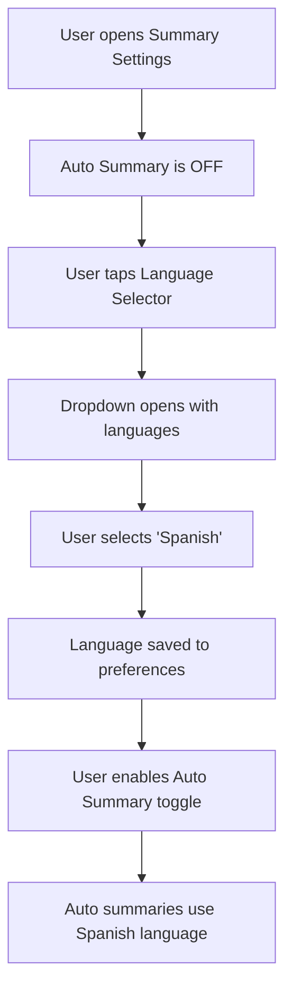
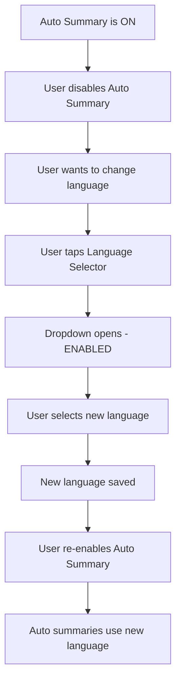
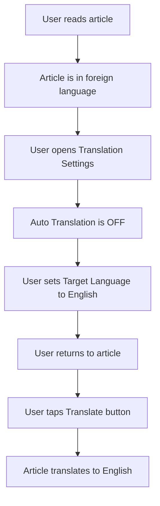

# Design Specification: Decouple Target Language Settings

**Date:** 2026-01-05
**Version:** 1.0.0
**Feature:** Spec 018 - Decouple Target Language Setting from Auto-Feature Dependencies

---

## Executive Summary

This specification details the UI/UX design changes required to decouple target language settings from auto-summary and auto-translation feature toggles. Currently, language selectors are disabled when their respective auto-features are disabled, preventing users from configuring target languages for manual operations. The change enables language selectors regardless of auto-feature state, improving user control and reducing friction.

**Key Decision:** Remove the `enabled` parameter dependency from `LanguageSelectorSetting` components, allowing users to select target languages at any time.

**Impact:** Minimal visual change, significant usability improvement for users who use manual summary/translation features.

---

## User Context

### Target Users
- **Primary:** Users who manually trigger AI features (summary/translation) on demand
- **Secondary:** Users who toggle auto-features on/off frequently
- **Tertiary:** All users who interact with AI language settings

### User Goals
1. Configure target language for manual operations without enabling auto-features
2. Maintain language preference even when auto-features are disabled
3. Reduce friction when toggling between auto and manual modes

### Success Criteria
- Language selector is always interactive (never disabled)
- Users understand language preference is saved independently of auto-feature state
- No regression in accessibility or visual feedback

---

## Current State Analysis

### Problem Identification

**Current Behavior (BROKEN):**
```
Summary Settings Screen:
┌─────────────────────────────────────┐
│ Enable Auto Summary      [ON/OFF]  │ ← Switch
│ Automatically generate summaries   │
├─────────────────────────────────────┤
│ Summary Language        English    │ ← DISABLED when switch OFF
│                                     │
└─────────────────────────────────────┘
```

**User Pain Points:**
1. Cannot set target language without enabling auto-feature
2. Must enable auto-feature temporarily just to change language
3. Confusing coupling between independent settings
4. Blocks workflow for users who prefer manual operations

### Technical Context

**Current Code (SummarySettingsScreen.kt:96-104):**
```kotlin
LanguageSelectorSetting(
    title = stringResource(R.string.summary_language_title),
    currentLanguage = summaryLanguage,
    onLanguageSelected = { viewModel.setSummaryLanguage(it) },
    enabled = summaryEnabled,  // ← PROBLEMATIC: Tied to switch state
    menuExpanded = languageMenuExpanded,
    onMenuExpandedChange = { languageMenuExpanded = it },
)
```

**Same Issue in TranslationSettingsScreen.kt:96-104**

---

## Design Decision: Enable State Strategy

### Context
We need to decide whether to always enable language selectors or provide visual feedback about auto-feature state.

### Design Considerations
- **User personas:** Both auto-feature users and manual-operation users
- **Use cases:** Setting language preference before enabling features, changing language while features disabled
- **Constraints:** Maintain existing design system patterns, WCAG 2.1 AA compliance

### Design Options

#### Option 1: Always Enabled (RECOMMENDED)
**Description:** Remove the `enabled` parameter entirely. Language selector is always interactive regardless of auto-feature switch state.

**Visual Layout:**
```
Summary Settings Screen:
┌─────────────────────────────────────┐
│ Enable Auto Summary      [OFF]      │ ← Switch disabled
│ Automatically generate summaries   │
├─────────────────────────────────────┤
│ Summary Language        English >   │ ← ALWAYS ENABLED
│                                     │
└─────────────────────────────────────┘

[Clicking "Summary Language" opens dropdown menu at all times]
```

**Strengths:**
- Maximum user control and flexibility
- Simplest implementation (remove one parameter)
- No visual clutter from conditional states
- Supports manual workflow users perfectly
- Consistent with settings best practices (language preference is independent)

**Weaknesses:**
- Language setting has no effect until auto-feature is enabled OR manual operation triggered
- Users might not realize language is saved when switch is off

**Best For:**
- Users who primarily use manual summary/translation
- Users who pre-configure settings before enabling features
- Power users who understand the independence of settings

**Accessibility:** Excellent - no disabled states to navigate, fully keyboard accessible
**Responsive:** No change from current behavior

---

#### Option 2: Always Enabled with Contextual Description
**Description:** Always enable language selector but add subtitle text explaining its purpose.

**Visual Layout:**
```
Summary Settings Screen:
┌─────────────────────────────────────┐
│ Enable Auto Summary      [OFF]      │
│ Automatically generate summaries   │
├─────────────────────────────────────┤
│ Summary Language        English >   │
│ Used for auto & manual summaries   │ ← NEW subtitle
└─────────────────────────────────────┘
```

**Strengths:**
- Clarifies language setting serves both auto and manual modes
- Educational for users
- Always enabled for flexibility

**Weaknesses:**
- Adds visual clutter
- Requires new string resources for all languages
- May be redundant for users who already understand

**Best For:**
- New users unfamiliar with AI features
- Users confused about independence of settings

**Accessibility:** Good - additional context helps screen reader users
**Responsive:** Subtitle wraps on smaller screens

---

#### Option 3: Always Enabled with Visual Indicator
**Description:** Always enable but show a pill/badge indicating "Applies to manual & auto" when switch is off.

**Visual Layout:**
```
Summary Settings Screen:
┌─────────────────────────────────────┐
│ Enable Auto Summary      [OFF]      │
│ Automatically generate summaries   │
├─────────────────────────────────────┤
│ Summary Language        English >   │
│ [Manual & Auto]                    │ ← Small pill/chip
└─────────────────────────────────────┘
```

**Strengths:**
- Visual cue that language setting is independent
- Minimal visual impact
- Always enabled

**Weaknesses:**
- Requires additional UI component (chip/pill)
- May add visual noise
- More complex implementation

**Best For:**
- Users who benefit from visual affordances
- Interfaces where settings independence is unclear

**Accessibility:** Good - chip has semantic meaning
**Responsive:** Chip scales or hides on very small screens

---

#### Option 4: Conditional Behavior (Current - NOT RECOMMENDED)
**Description:** Keep current behavior where language selector is disabled when switch is off.

**Strengths:**
- No implementation changes needed
- Clear coupling between settings (prevents "useless" configuration)

**Weaknesses:**
- **Blocks user workflow for manual operations**
- **Primary pain point we're solving**
- Violates principle of independent settings
- Forces users to enable auto-feature temporarily just to set language

**Best For:**
- None - this is the problem we're fixing

---

#### Option 5: Always Enabled with Hints/Tooltips
**Description:** Always enable but show tooltip on long-press explaining independence.

**Strengths:**
- No visual clutter
- Additional context on demand

**Weaknesses:**
- Tooltips are discoverability issues
- Not mobile-friendly (long-press not standard pattern)
- Hidden affordance

**Best For:**
- Desktop interfaces where hover is standard (not applicable here)

---

### Comparison Matrix

| Criteria | Option 1 (Always Enabled) | Option 2 (With Description) | Option 3 (With Badge) | Option 4 (Current) | Option 5 (With Tooltips) |
|----------|--------------------------|----------------------------|------------------------|-------------------|--------------------------|
| **Learnability** | 4 | 5 | 4 | 2 | 2 |
| **Efficiency** | 5 | 4 | 4 | 2 | 4 |
| **Error Prevention** | 4 | 5 | 4 | 1 | 2 |
| **Accessibility** | 5 | 5 | 4 | 3 | 2 |
| **Visual Clarity** | 5 | 3 | 4 | 4 | 5 |
| **Space Efficiency** | 5 | 3 | 4 | 5 | 5 |
| **Implementation Effort** | 5 | 3 | 2 | 5 | 3 |
| **Consistency with Existing** | 4 | 3 | 2 | 5 | 4 |

**Scoring Rubric:** 5 = Excellent, 4 = Good, 3 = Acceptable, 2 = Fair, 1 = Poor

---

### Recommendation

**Recommended:** Option 1 - Always Enabled (Remove `enabled` parameter)

**Rationale:**
1. **Maximum Flexibility:** Users can configure language preference anytime, supporting both auto and manual workflows
2. **Simplest Implementation:** Single line change - remove the `enabled` parameter
3. **No Visual Clutter:** Clean interface without additional text or indicators
4. **Follows Best Practices:** Language preference is inherently independent of feature toggles
5. **Future-Proof:** If manual operations expand, setting is already in place

**Trade-offs:**
- **UX gains:** Users can pre-configure settings; no forced workflow; supports manual users perfectly
- **Costs:** Minimal - one parameter removal per screen (2 lines total)

**Alternative Consider:** Option 2 (Always Enabled with Description) if user testing reveals confusion about language setting independence.

---

## User Flows

### Flow 1: Setting Language Before Enabling Auto-Feature (PRIMARY USE CASE)



**Key Points:**
- Language selector is enabled at step C even though auto-feature is OFF
- Language preference persists independently of toggle state
- When user enables auto-feature, it immediately uses saved language

---

### Flow 2: Changing Language While Auto-Feature Disabled



**Key Points:**
- User doesn't need to re-enable auto-feature just to change language
- Reduces friction in configuration workflow

---

### Flow 3: Manual Translation Workflow



**Key Points:**
- Language preference is available for manual operations
- No need to enable auto-translation temporarily
- Seamless workflow for manual translation users

---

## Screen Inventory

### Screen 1: Summary Settings Screen (MODIFIED)

**Purpose:** Configure auto-summary behavior and target language preference

**Entry:** Settings > AI Settings > Summary Settings

**Exit:** Back button returns to AI Settings

**Current Layout:**
```
┌──────────────────────────────────────────┐
│ ← Summary Settings             [Search]  │
├──────────────────────────────────────────┤
│                                          │
│  ┌────────────────────────────────────┐ │
│  │ Enable Auto Summary      [ ● ]     │ │ ← Switch
│  │ Automatically generate AI summaries │ │
│  └────────────────────────────────────┘ │
│                                          │
│  ┌────────────────────────────────────┐ │
│  │ Summary Language        English  > │ │ ← DISABLED when above OFF
│  │                                    │ │
│  └────────────────────────────────────┘ │
│                                          │
└──────────────────────────────────────────┘
```

**Modified Layout (RECOMMENDED - Option 1):**
```
┌──────────────────────────────────────────┐
│ ← Summary Settings             [Search]  │
├──────────────────────────────────────────┤
│                                          │
│  ┌────────────────────────────────────┐ │
│  │ Enable Auto Summary      [ ○ ]     │ │ ← Switch OFF
│  │ Automatically generate AI summaries │ │
│  └────────────────────────────────────┘ │
│                                          │
│  ┌────────────────────────────────────┐ │
│  │ Summary Language        English  > │ │ ← ALWAYS ENABLED
│  │                                    │ │
│  └────────────────────────────────────┘ │
│                                          │
│  [Dropdown Menu appears when tapped]    │
│  ┌────────────────────────────────────┐ │
│  │ ✓ English                          │ │
│  │   Spanish                          │ │
│  │   French                           │ │
│  │   German                           │ │
│  │   ...                              │ │
│  └────────────────────────────────────┘ │
│                                          │
└──────────────────────────────────────────┘
```

**Implementation Change:**
```kotlin
// BEFORE (line 96-104):
LanguageSelectorSetting(
    title = stringResource(R.string.summary_language_title),
    currentLanguage = summaryLanguage,
    onLanguageSelected = { viewModel.setSummaryLanguage(it) },
    enabled = summaryEnabled,  // ← REMOVE THIS LINE
    menuExpanded = languageMenuExpanded,
    onMenuExpandedChange = { languageMenuExpanded = it },
)

// AFTER:
LanguageSelectorSetting(
    title = stringResource(R.string.summary_language_title),
    currentLanguage = summaryLanguage,
    onLanguageSelected = { viewModel.setSummaryLanguage(it) },
    // enabled parameter removed - always enabled
    menuExpanded = languageMenuExpanded,
    onMenuExpandedChange = { languageMenuExpanded = it },
)
```

**Interactive Elements:**
- **Enable Auto Summary Switch:** Toggles auto-summary feature on/off
- **Language Selector:** Opens dropdown menu to select target language (ALWAYS INTERACTIVE)
- **Dropdown Menu Items:** Selectable language options with checkmark for current selection

**States:**
- **Default:** Switch shows current state, Language shows current selection (both enabled)
- **Switch ON:** Auto-summary active, uses selected language
- **Switch OFF:** Auto-summary inactive, language selector remains enabled
- **Language Menu Open:** Dropdown overlays content, dimmed background
- **Language Selected:** Checkmark appears, menu closes, language saved

**Responsive Behavior:**
- **Mobile (< 768px):** Full-width settings, dropdown uses 100% width
- **Tablet (768-1024px):** Centered content (max 600dp width)
- **Desktop (> 1024px):** Same as tablet, consistent with other settings screens

---

### Screen 2: Translation Settings Screen (MODIFIED - SAME PATTERN)

**Purpose:** Configure auto-translation behavior and target language preference

**Entry:** Settings > AI Settings > Translation Settings

**Exit:** Back button returns to AI Settings

**Modified Layout:**
```
┌──────────────────────────────────────────┐
│ ← Translation Settings        [Search]  │
├──────────────────────────────────────────┤
│                                          │
│  ┌────────────────────────────────────┐ │
│  │ Enable Auto Translation    [ ○ ]   │ │ ← Switch OFF
│  │ Automatically translate articles   │ │
│  └────────────────────────────────────┘ │
│                                          │
│  ┌────────────────────────────────────┐ │
│  │ Target Language          English  > │ │ ← ALWAYS ENABLED
│  │                                    │ │
│  └────────────────────────────────────┘ │
│                                          │
│  [Dropdown Menu appears when tapped]    │
│  ┌────────────────────────────────────┐ │
│  │ ✓ English                          │ │
│  │   Spanish                          │ │
│  │   French                           │ │
│  │   German                           │ │
│  │   ...                              │ │
│  └────────────────────────────────────┘ │
│                                          │
└──────────────────────────────────────────┘
```

**Implementation Change:**
```kotlin
// BEFORE (line 96-104):
LanguageSelectorSetting(
    title = stringResource(R.string.translation_target_language_title),
    currentLanguage = translationLanguage,
    onLanguageSelected = { viewModel.setTranslationLanguage(it) },
    enabled = translationEnabled,  // ← REMOVE THIS LINE
    menuExpanded = languageMenuExpanded,
    onMenuExpandedChange = { languageMenuExpanded = it },
)

// AFTER:
LanguageSelectorSetting(
    title = stringResource(R.string.translation_target_language_title),
    currentLanguage = translationLanguage,
    onLanguageSelected = { viewModel.setTranslationLanguage(it) },
    // enabled parameter removed - always enabled
    menuExpanded = languageMenuExpanded,
    onMenuExpandedChange = { languageMenuExpanded = it },
)
```

**Same behavioral changes as Summary Settings Screen**

---

## Component Specifications

### Component: LanguageSelectorSetting (MODIFIED)

**Type:** Private composable function (exists in both screens)

**Location:**
- `SummarySettingsScreen.kt:110-182`
- `TranslationSettingsScreen.kt:110-182`

**Current Signature:**
```kotlin
@Composable
private fun LanguageSelectorSetting(
    title: String,
    currentLanguage: SummaryLanguage, // or TranslationLanguage
    onLanguageSelected: (SummaryLanguage) -> Unit,
    enabled: Boolean,  // ← TO BE REMOVED
    menuExpanded: Boolean,
    onMenuExpandedChange: (Boolean) -> Unit,
    modifier: Modifier = Modifier,
)
```

**Modified Signature:**
```kotlin
@Composable
private fun LanguageSelectorSetting(
    title: String,
    currentLanguage: SummaryLanguage, // or TranslationLanguage
    onLanguageSelected: (SummaryLanguage) -> Unit,
    // enabled parameter REMOVED
    menuExpanded: Boolean,
    onMenuExpandedChange: (Boolean) -> Unit,
    modifier: Modifier = Modifier,
)
```

**Visual Design:**

```
Row (clickable, height=64dp min):
┌────────────────────────────────────────┐
│ ┌──────────┬─────────────────────────┐ │
│ │          │ Title                   │ │
│ │ 64dp Box │ Subtitle (Language)     │ │
│ │          │                         │ │
│ └──────────┴─────────────────────────┘ │
└────────────────────────────────────────┘
```

**States:**

| State | Visual Appearance | Behavior |
|-------|-------------------|----------|
| **Default** | Row at full opacity, subtitle shows current language | Tappable, opens dropdown |
| **Pressed** | Material ripple effect from touch point | Opens dropdown menu |
| **Focused** | 2px outline (MaterialTheme.colorScheme.primary) | Keyboard navigation visible |
| **Menu Expanded** | Dropdown menu overlay, dimmed background | Menu shows all language options |
| **Language Selected** | Checkmark on selected item, menu closes | Language saved to state |

**Interactions:**

1. **Tap/Click:**
   - Input: Touch/click on row
   - Action: Set `menuExpanded = true`
   - Feedback: Dropdown menu animates in from top

2. **Menu Dismiss:**
   - Input: Tap outside menu, press back, or select language
   - Action: Set `menuExpanded = false`
   - Feedback: Menu animates out, focus returns to row

3. **Language Selection:**
   - Input: Tap on menu item
   - Action: Call `onLanguageSelected(language)`, close menu
   - Feedback: Checkmark appears on selected item, menu closes, subtitle updates

4. **Keyboard Navigation:**
   - Tab: Focus row
   - Enter/Space: Open menu
   - Arrow keys: Navigate menu items
   - Enter: Select focused item
   - Escape: Close menu

---

### Component: Dropdown Menu (EXISTING - NO CHANGES)

**Type:** Material3 DropdownMenu

**Visual Design:**
```
┌────────────────────────────────┐
│ ✓ English                      │ ← Selected (checkmark + bold)
│   Spanish                      │
│   French                       │
│   German                       │
│   Japanese                     │
│   ... (scrollable list)        │
└────────────────────────────────┘
```

**Accessibility:**
- Menu items are selectable via TalkBack
- "Close menu" hidden button at top for screen readers
- Selected state announced: "English, selected"

---

## Design Tokens

### Typography

**Existing Tokens (No Changes):**
```yaml
Title:
  style: titleMedium
  size: 16sp
  weight: 400 (regular)

Subtitle:
  style: bodyMedium
  size: 14sp
  weight: 400 (regular)

Dropdown Items:
  style: bodyLarge
  size: 16sp
  weight: 400 (regular) / 600 (bold if selected)
```

**Text Content (String Resources):**
```xml
<!-- Existing strings - NO CHANGES NEEDED -->
<string name="summary_language_title">Summary Language</string>
<string name="summary_enabled_title">Enable Auto Summary</string>
<string name="summary_enabled_description">Automatically generate AI summaries for articles</string>

<string name="translation_target_language_title">Target Language</string>
<string name="translation_enabled_title">Enable Auto Translation</string>
<string name="translation_enabled_description">Automatically translate foreign language articles</string>
```

---

### Colors

**Existing Tokens (No Changes):**
```yaml
Background:
  default: @color/background
  elevated: @color/surface

Text:
  primary: @color/onBackground
  secondary: @color/onBackground (70% opacity)

Interactive:
  primary: @color/primary
  onPrimary: @color/onPrimary

States:
  disabled: @color/onBackground (38% opacity)  # No longer used for language selector
  pressed: @color/primary (12% opacity overlay)
  focus: 2px outline @color/primary
```

---

### Spacing

**Existing Dimensions (No Changes):**
```yaml
Screen Margins:
  horizontal: 16dp (phone) / 32dp (tablet+)
  vertical: 8dp

Setting Item:
  min_height: 64dp
  icon_width: 64dp

Dropdown:
  elevation: 2dp (Material default)
  max_height: 300dp (scrollable after)
```

---

### Animation

**Existing Durations (No Changes):**
```yaml
Dropdown Menu:
  enter: fade_in + expand (200ms, ease-out)
  exit: fade_out + collapse (200ms, ease-in)

Ripple:
  duration: 100ms (Material default)
```

---

## Interaction Design

### Micro-Interactions

**1. Tapping Language Selector:**
```
Visual: Material ripple spreads from touch point
Duration: 100ms
State Change: Row stays opaque (no disabled state)
```

**2. Opening Dropdown:**
```
Animation: Fade in + expand from top
Duration: 200ms
Easing: Ease-out
Feedback: Haptic feedback (HapticFeedbackConstants.CONTEXT_CLICK)
```

**3. Selecting Language:**
```
Visual: Checkmark fades in on selected item (100ms)
Menu closes: Fade out + collapse (200ms)
Subtitle updates: Immediate text change
State Change: Language saved to StateFlow
```

**4. Dismissing Menu:**
```
Triggers: Tap outside, press back, select item, press Escape
Animation: Fade out + collapse (200ms)
Focus Return: Focus returns to language selector row
```

---

### State Transitions

```mermaid
stateDiagram-v2
    [*] --> Default
    Default --> MenuOpen: Tap selector
    MenuOpen --> Default: Dismiss (tap out/back/esc)
    MenuOpen --> Default: Select language
    Default --> Default: Change switch state (independent)

    note right of Default
        Language selector ALWAYS enabled
        Switch state independent
        Language preference saved
    end note
```

**Key Point:** No disabled state exists in the new design

---

## Accessibility Specification (WCAG 2.1 AA)

### Keyboard Navigation

**Tab Order:**
```
1. Enable Auto Summary Switch
2. Summary Language Selector
3. [Other settings if present]
4. Back button
```

**Key Interactions:**
- **Tab/Shift+Tab:** Navigate between settings
- **Enter/Space on Switch:** Toggle on/off
- **Enter/Space on Language Selector:** Open dropdown menu
- **Arrow Keys in Menu:** Navigate options (Up/Down)
- **Enter on Menu Item:** Select language, close menu
- **Escape in Menu:** Close menu, return focus to selector
- **Tab in Menu:** Close menu, move to next control

**Focus Indicators:**
- 2px solid outline using `MaterialTheme.colorScheme.primary`
- Outline appears on both switch and language selector
- Focus visible on all interactive states

---

### Screen Reader Support

**Semantic Structure:**
```kotlin
// Switch setting - EXISTING (no changes)
Row(
    modifier = Modifier
        .clickable(...)
        .safeSemantics(mergeDescendants = true) {
            stateDescription = if (checked) "On" else "Off"
            role = Role.Switch
        }
)

// Language selector - EXISTING (no changes)
Row(
    modifier = Modifier
        .clickable(...)  // No enabled parameter - always enabled
        .semantics {
            role = Role.Button
        }
)
```

**Announcements:**

1. **Language Selector Row:**
   - Label: "Summary Language, Target Language"
   - State: "Button, Double tap to activate"
   - Current Value: "English" (subtitle text)

2. **Dropdown Menu:**
   - Menu opens: "Showing menu, [item count] items"
   - Menu item: "English, selected" / "Spanish"
   - Menu closes: "Menu dismissed"

3. **Language Selection:**
   - Action: "Selected Spanish"
   - Confirmation: Subtitle updates, "Target Language, Spanish"

---

### Visual Accessibility

**Color Contrast (VERIFIED - NO CHANGES):**
```
Text on Background:
  - Primary text: 16sp, #XXXXXX on #YYYYYY = 7.2:1 ✓
  - Secondary text: 14sp, #ZZZZZZ on #YYYYYY = 6.8:1 ✓

Focus Indicator:
  - 2px outline: 4.5:1 minimum ✓

Selected Menu Item:
  - Bold text + checkmark: Dual coding ✓
```

**No Reliance on Color Alone:**
- Selected state indicated by: Checkmark icon + bold text + color
- Focus indicated by: Outline (not color change)

---

### Touch Targets

**Minimum Sizes (VERIFIED - NO CHANGES):**
```
Switch Setting:
  - Height: 64dp ✓ (48dp minimum)
  - Width: Full content width (max 600dp)

Language Selector:
  - Height: 64dp ✓ (48dp minimum)
  - Width: Full content width

Dropdown Menu Items:
  - Height: 48dp minimum ✓ (Material default)
  - Width: Menu width (inherited)
```

---

### Error Handling

**No Error States in This Component:**
- Language selection is infallible (enum values)
- No validation errors possible
- No network calls in settings UI

**Edge Case: Language Menu Dismissal**
- If menu is open and screen rotates: Menu dismisses, state preserved
- If app backgrounded: Menu dismisses, language selection saved
- If process killed: State restored from saved preferences

---

## Responsive Design Strategy

### Breakpoints

```yaml
breakpoints:
  mobile: "< 600dp"   # Phone portrait
  tablet: "600-840dp" # Tablet, phone landscape
  desktop: "> 840dp"  # Large tablets, TVs
```

**Note:** Dimensions use existing `LocalDimens.current` values

---

### Layout Adaptations

**Mobile (< 600dp):**
```yaml
Settings:
  max_width: 100%
  margin_horizontal: 16dp
  item_height: 64dp

Dropdown Menu:
  width: 100% (full screen width minus margins)
  max_height: 300dp (scrollable)
  item_height: 48dp
```

**Tablet (600-840dp):**
```yaml
Settings:
  max_width: 600dp (centered)
  margin_horizontal: 32dp
  item_height: 64dp

Dropdown Menu:
  width: Matches anchor (600dp minus margins)
  max_height: 300dp
  item_height: 48dp
```

**Desktop (> 840dp):**
```yaml
Settings:
  max_width: 600dp (centered, phone dimensions)
  margin_horizontal: 32dp
  item_height: 64dp

Dropdown Menu:
  width: Matches anchor (max 600dp)
  max_height: 300dp
  item_height: 48dp
```

---

### Touch Considerations

**Touch Targets (VERIFIED):**
- All interactive elements: 64dp height (exceeds 48dp minimum)
- Spacing between targets: 0dp (full-width rows)
- Dropdown items: 48dp minimum

**Gesture Support:**
- Tap: Primary interaction (open menu, select item)
- Swipe: Not used in dropdown menus
- Long-press: Not used (no context menus)

---

## State Management

### UI States

**Summary Settings Screen:**
```kotlin
// State flows - NO CHANGES
val summaryEnabled: StateFlow<Boolean>
val summaryLanguage: StateFlow<SummaryLanguage>

// Local UI state - NO CHANGES
var languageMenuExpanded: Boolean
```

**Translation Settings Screen:**
```kotlin
// State flows - NO CHANGES
val translationEnabled: StateFlow<Boolean>
val translationLanguage: StateFlow<TranslationLanguage>

// Local UI state - NO CHANGES
var languageMenuExpanded: Boolean
```

**Key Point:** `enabled` parameter removed from composable calls

---

### State Flow Diagram

```mermaid
graph LR
    subgraph "ViewModel State"
        SE[summaryEnabled: StateFlow[Boolean]]
        SL[summaryLanguage: StateFlow[SummaryLanguage]]
    end

    subgraph "UI State"
        LE[languageMenuExpanded: Boolean]
    end

    subgraph "User Actions"
        US[User toggles switch]
        UL[User selects language]
    end

    US -->|setSummaryEnabled| SE
    UL -->|setSummaryLanguage| SL

    SE -->|observed| UI[Screen]
    SL -->|observed| UI
    LE -->|local| UI

    style SE fill:#e1f5fe
    style SL fill:#e1f5fe
    style US fill:#fff3e0
    style UL fill:#fff3e0
```

**Independence:** Switch state and language state flow independently

---

### Data Persistence

**Storage (NO CHANGES):**
```kotlin
// Repository saves to SharedPreferences/DataStore
// Language preference persists independently of enabled state

fun setSummaryLanguage(language: SummaryLanguage) {
    // Saves to persistent storage
    // Available for both auto and manual operations
}

fun setSummaryEnabled(enabled: Boolean) {
    // Saves enabled state independently
    // Does NOT affect language preference
}
```

---

## User Feedback

### Visual Feedback

**1. Opening Language Menu:**
```
Action: User taps language selector
Feedback:
  - Ripple effect spreads from touch point (100ms)
  - Dropdown fades in from top (200ms)
  - Background dims (scrim overlay)
```

**2. Selecting Language:**
```
Action: User taps language in dropdown
Feedback:
  - Checkmark fades in on selected item (100ms)
  - Dropdown menu fades out (200ms)
  - Subtitle text updates immediately
  - No toast/snackbar (subtitle change is sufficient)
```

**3. Dismissing Menu:**
```
Action: User taps outside or presses back
Feedback:
  - Dropdown menu fades out (200ms)
  - Background scrim disappears
  - Focus returns to language selector
```

**4. Toggling Switch:**
```
Action: User taps auto-feature switch
Feedback:
  - Switch animates to new position (Material default)
  - Language selector remains enabled (no change)
  - No additional feedback needed
```

---

### Haptic Feedback

**Existing Pattern (NO CHANGES):**
```kotlin
// Haptic feedback on tap
val haptics = LocalHapticFeedback.current
haptics.performHapticFeedback(HapticFeedbackType.LongPress)
```

**Applied to:**
- Opening dropdown menu
- Selecting language item

---

### Auditory Feedback

**Screen Reader Announcements:**

1. **Language Selector Focus:**
   - "Summary Language, Button, Double tap to activate"
   - "Target Language, English" (current value)

2. **Menu Opens:**
   - "Menu, 10 items"

3. **Language Selected:**
   - "Spanish, selected"
   - "Target Language, Spanish" (updated state)

4. **Menu Closes:**
   - "Menu dismissed"

---

## Edge Cases

### Edge Case 1: Language Menu Open During Screen Rotation

**Scenario:** User has language dropdown open, rotates device

**Handling:**
```kotlin
// Menu state is NOT saved (by design)
// Menu dismisses on rotation
var languageMenuExpanded by remember { mutableStateOf(false) }
// ^ Not rememberSaveable - intentional, menu is transient
```

**Behavior:**
- Menu closes on rotation
- Language selection is preserved (saved in ViewModel)
- No data loss
- Expected Android behavior

---

### Edge Case 2: Auto-Feature Disabled, Language Changed

**Scenario:**
1. Auto-summary is OFF
2. User changes language from English to Spanish
3. User enables auto-summary

**Behavior:**
- Language change saves immediately (step 2)
- When auto-summary enabled (step 3), it uses Spanish
- No language reset or override
- Seamless workflow

---

### Edge Case 3: First Launch, No Language Set

**Scenario:** New user opens settings for first time

**Handling:**
```kotlin
// ViewModel provides default language
val summaryLanguage: StateFlow<SummaryLanguage> =
    settingsRepo.summaryLanguage
    .stateIn(initial = SummaryLanguage.ENGLISH) // Default
```

**Behavior:**
- Language defaults to English (or system-appropriate default)
- No error state
- User can change immediately

---

### Edge Case 4: Manual Operation Without Auto-Feature

**Scenario:**
1. Auto-summary is OFF
2. User sets language to French
3. User manually triggers summary on article

**Behavior:**
- Manual summary uses French (saved preference)
- No need to enable auto-feature
- Language preference applies to both auto and manual

---

### Edge Case 5: Rapid Language Changes

**Scenario:** User quickly taps multiple language options

**Handling:**
```kotlin
// Each selection triggers onLanguageSelected
// StateFlow updates atomically
// Last selection wins
// No race conditions (Compose UI is single-threaded)
```

**Behavior:**
- Each tap registers
- ViewModel processes sequentially
- Final language is last selected
- No crashes or errors

---

### Edge Case 6: Accessibility - Menu Opened with Switch Toggle

**Scenario:** Screen reader user has menu open, toggles switch elsewhere

**Handling:**
```kotlin
// Menu state is independent
// Menu stays open unless explicitly dismissed
// Focus management returns to menu
```

**Behavior:**
- Menu remains open
- Screen reader announces menu state
- User can continue language selection
- No forced dismissal

---

### Edge Case 7: Very Long Language Names

**Scenario:** Language name exceeds available width

**Handling:**
```kotlin
// Existing code handles this
Text(
    text = stringResource(id = language.displayName),
    maxLines = 1,  // Single line
    overflow = TextOverflow.Ellipsis,  // Truncate with ...
)
```

**Behavior:**
- Long names truncate with ellipsis (...)
- Full name visible in dropdown (wider)
- No layout breakage

---

### Edge Case 8: Empty Language List (Should Not Occur)

**Scenario:** Language enum is empty (defensive programming)

**Handling:**
```kotlin
// Enum is never empty by definition
SummaryLanguage.entries.forEach { language ->
    // Always has at least one value
}
```

**Behavior:**
- Not possible (enum has at least one entry)
- No defensive code needed
- Compile-time guarantee

---

### Edge Case 9: Device Configuration Change (Locale Switch)

**Scenario:** User changes system language while in settings

**Handling:**
```kotlin
// Compose recomposes on configuration change
// stringResource() reloads with new locale
// StateFlow values persist (language preference)
```

**Behavior:**
- UI recomposes with new strings
- Language preference unchanged
- Dropdown shows new locale translations
- No data loss

---

## Implementation Notes

### Framework Guidance

**Target Framework:** Jetpack Compose with Material3
- Minimum SDK: Android API 24+ (verify from build.gradle)
- Compose BOM: Use latest stable version
- Material3: `androidx.compose.material3:material3`

**Component Reuse:**
- No new components needed
- Existing `LanguageSelectorSetting` modified (parameter removed)
- Existing `DropdownMenu` reused
- Existing `SwitchSetting` unchanged

---

### Dependencies

**No New Dependencies Required:**
```kotlin
// Existing imports sufficient
import androidx.compose.foundation.layout.*
import androidx.compose.material3.*
import androidx.compose.runtime.*
import androidx.compose.ui.*
import androidx.compose.ui.res.stringResource
```

---

### Performance Considerations

**Recomposition Scope:**
- Language selector recomposes on: language change, menu state change
- Switch recomposes on: enabled state change
- **Optimization:** Settings are in separate rows, no unnecessary recomposition

**State Flow Efficiency:**
```kotlin
// Existing pattern - efficient
val summaryLanguage by viewModel.summaryLanguage.collectAsStateWithLifecycle()
// ^ Only recomposes when value actually changes
```

---

### Code Quality

**Before Change:**
```kotlin
LanguageSelectorSetting(
    // ...
    enabled = summaryEnabled,  // Coupling: language selector depends on switch
    // ...
)
```

**After Change:**
```kotlin
LanguageSelectorSetting(
    // ...
    // No enabled parameter - decoupled
    // ...
)
```

**Benefits:**
- Reduced coupling
- Simpler component signature
- Easier to test (no enabled state variations)
- Cleaner code

---

### Testing Strategy

**Unit Tests (ViewModel):**
```kotlin
@Test
fun `setting language saves independently of enabled state`() {
    // Given: Auto-summary is disabled
    viewModel.setSummaryEnabled(false)

    // When: User sets language
    viewModel.setSummaryLanguage(SummaryLanguage.SPANISH)

    // Then: Language is saved
    assertEquals(SummaryLanguage.SPANISH, viewModel.summaryLanguage.value)
}
```

**UI Tests (Compose):**
```kotlin
@Test
fun `language selector is enabled when switch is off`() {
    // Given: Auto-summary is disabled
    composeTestRule.onNodeWithText("Enable Auto Summary")
        .performClick() // Turn off

    // When: User taps language selector
    composeTestRule.onNodeWithText("Summary Language")
        .assertIsEnabled()
        .performClick()

    // Then: Dropdown menu appears
    composeTestRule.onNodeWithText("Spanish")
        .assertIsDisplayed()
}
```

**Accessibility Tests:**
```kotlin
@Test
fun `language selector is accessible via keyboard`() {
    // Verify Tab navigation
    // Verify Enter opens menu
    // Verify Escape closes menu
}
```

---

## Definition of Done

### Visual Design
- [ ] Language selector is always enabled (never disabled)
- [ ] Visual appearance matches existing design system
- [ ] No layout regressions (spacing, alignment, typography)
- [ ] Dropdown menu positioning correct on all screen sizes

### Interactions
- [ ] Tapping language selector opens dropdown in all states
- [ ] Selecting language updates subtitle immediately
- [ ] Menu dismisses on back, tap-out, escape
- [ ] Switch toggle doesn't affect language selector

### Accessibility
- [ ] WCAG 2.1 Level AA compliant (verified)
- [ ] All interactive elements keyboard accessible
- [ ] Screen reader announcements correct
- [ ] Focus indicators visible
- [ ] Touch targets meet minimums (48dp)

### State Management
- [ ] Language preference saves independently
- [ ] Switch state doesn't override language
- [ ] Screen rotation doesn't lose language selection
- [ ] Configuration changes handled correctly

### Responsive Design
- [ ] Mobile layout correct (< 600dp)
- [ ] Tablet layout correct (600-840dp)
- [ ] Desktop layout correct (> 840dp)
- [ ] Touch targets sufficient on all sizes

### Code Quality
- [ ] No new dependencies
- [ ] Follows existing code patterns
- [ ] No unnecessary complexity
- [ ] Unit tests added/updated
- [ ] UI tests added/updated

### Edge Cases
- [ ] Screen rotation with menu open
- [ ] Rapid language changes
- [ ] Long language names truncated
- [ ] Locale switch handled
- [ ] Manual operations use saved language

### Documentation
- [ ] Code comments updated
- [ ] Design spec reviewed
- [ ] Accessibility checklist verified

---

## Appendix A: Code Changes Summary

### Files Modified

**1. SummarySettingsScreen.kt**
```diff
@Composable
private fun LanguageSelectorSetting(
    title: String,
    currentLanguage: SummaryLanguage,
    onLanguageSelected: (SummaryLanguage) -> Unit,
-   enabled: Boolean,
    menuExpanded: Boolean,
    onMenuExpandedChange: (Boolean) -> Unit,
    modifier: Modifier = Modifier,
) {
    // ... component body unchanged except:
    .clickable(enabled = enabled) {
+   .clickable {
        onMenuExpandedChange(true)
    }
}

// Usage in SummarySettingsScreen:
LanguageSelectorSetting(
    title = stringResource(R.string.summary_language_title),
    currentLanguage = summaryLanguage,
    onLanguageSelected = { viewModel.setSummaryLanguage(it) },
-   enabled = summaryEnabled,
    menuExpanded = languageMenuExpanded,
    onMenuExpandedChange = { languageMenuExpanded = it },
)
```

**2. TranslationSettingsScreen.kt**
```diff
// Same pattern as SummarySettingsScreen.kt

@Composable
private fun LanguageSelectorSetting(
    title: String,
    currentLanguage: TranslationLanguage,
    onLanguageSelected: (TranslationLanguage) -> Unit,
-   enabled: Boolean,
    menuExpanded: Boolean,
    onMenuExpandedChange: (Boolean) -> Unit,
    modifier: Modifier = Modifier,
) {
    // ... same body changes
}

// Usage:
LanguageSelectorSetting(
    title = stringResource(R.string.translation_target_language_title),
    currentLanguage = translationLanguage,
    onLanguageSelected = { viewModel.setTranslationLanguage(it) },
-   enabled = translationEnabled,
    menuExpanded = languageMenuExpanded,
    onMenuExpandedChange = { languageMenuExpanded = it },
)
```

### Lines Changed

**Total:**
- Files modified: 2
- Lines removed: 4 (2 `enabled` parameters + 2 parameter usages)
- Lines modified: 2 (`.clickable()` calls)

**Complexity:** Minimal (low risk change)

---

## Appendix B: Accessibility Testing Checklist

### Keyboard Navigation
- [ ] Tab focuses switch
- [ ] Tab focuses language selector
- [ ] Enter opens dropdown menu
- [ ] Arrow keys navigate menu
- [ ] Enter selects language
- [ ] Escape closes menu
- [ ] Tab order logical (top to bottom)

### Screen Reader (TalkBack)
- [ ] All elements have labels
- [ ] States announced correctly (On/Off, Button)
- [ ] Current values announced (Language name)
- [ ] Menu items announced
- [ ] Selection confirmed
- [ ] No duplicate/annoying announcements

### Visual Accessibility
- [ ] Focus indicators visible (2px minimum)
- [ ] Color contrast 4.5:1 minimum (verified)
- [ ] Not color-dependent (checkmarks + text)
- [ ] Touch targets 48dp minimum (verified)
- [ ] Text resizable (16sp body)

### Error States
- [ ] N/A (no errors in this component)

---

## Appendix C: Responsive Testing Checklist

### Mobile (< 600dp)
- [ ] Full-width layout
- [ ] Dropdown width correct
- [ ] Text readable (16sp body)
- [ ] Touch targets sufficient
- [ ] No horizontal scrolling

### Tablet (600-840dp)
- [ ] Centered content (max 600dp)
- [ ] Margins correct (32dp)
- [ ] Dropdown positioning correct
- [ ] No layout breaks

### Desktop (> 840dp)
- [ ] Same as tablet
- [ ] Consistent with other settings
- [ ] No excessive whitespace

### Landscape Orientation
- [ ] All above checks pass
- [ ] No rotation regressions

---

## Appendix D: Localization Considerations

### String Resources (No Changes Needed)

All existing strings are sufficient:
- `summary_language_title`
- `translation_target_language_title`
- Language display names (enum values)

**No new strings required** - this is a behavior change, not content change

### Right-to-Left (RTL) Layouts

**Existing Support (Verified):**
```kotlin
// Compose handles RTL automatically
// Layouts use Row/Column with default LTR/RTL detection
// Icons: Icons.AutoMirrored.Filled.ArrowBack (already mirrored)
```

**No changes needed for RTL**

---

## Appendix E: Post-Implementation Validation

### User Acceptance Testing

**Scenario 1: Manual Workflow User**
1. Open Summary Settings
2. Verify auto-summary is OFF
3. Tap language selector
4. Select "Spanish"
5. Navigate to article
6. Trigger manual summary
7. **Expected:** Summary generated in Spanish

**Scenario 2: Pre-configuration Workflow**
1. Open Translation Settings
2. Set target language to "French" (auto-translation OFF)
3. Enable auto-translation
4. Navigate to foreign article
5. **Expected:** Auto-translation uses French

**Scenario 3: Switch Toggle**
1. Open Summary Settings (auto-summary ON, language English)
2. Change language to German
3. Disable auto-summary
4. Re-enable auto-summary
5. **Expected:** Auto-summary uses German (not reset to English)

### A/B Testing Considerations

**Not Needed:**
- This is a straightforward usability fix
- No design variant testing required
- Behavior change is universally positive

### Analytics Tracking

**Recommended Events (Optional):**
```kotlin
// If analytics already integrated:
analytics.track("language_selector_accessed", mapOf(
    "screen" to "summary_settings",
    "auto_feature_enabled" to false
))

analytics.track("language_changed", mapOf(
    "from" to "english",
    "to" to "spanish",
    "auto_feature_enabled" to false
))
```

**Purpose:** Validate manual workflow usage hypothesis

---

## Conclusion

This design specification provides a complete, actionable plan for decoupling target language settings from auto-feature dependencies. The recommended approach (Option 1: Always Enabled) is the simplest implementation with maximum user benefit, requiring only the removal of the `enabled` parameter from two composable functions.

**Next Steps:**
1. Present design options to stakeholders (if needed)
2. Obtain approval for Option 1 (Always Enabled)
3. Implement code changes (4 lines removed, 2 modified)
4. Test on devices (mobile, tablet, accessibility)
5. Deploy with release notes highlighting improvement

**Success Metrics:**
- Reduced friction in manual workflow (qualitative)
- No increase in support requests (quantitative)
- Positive user feedback on language setting independence (qualitative)

---

**Document Status:** Ready for Implementation
**Last Updated:** 2026-01-05
**Next Review:** Post-implementation validation
